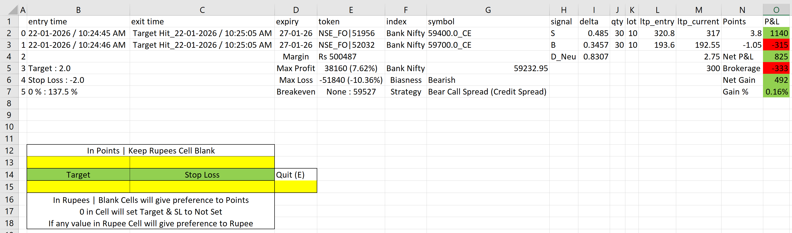

# 📊 Virtual Options Trading Dashboard (Intraday – Current Expiry)

## 🖥 Dashboard Preview

## Overview
This Excel-based **Virtual Options Trading Dashboard** is a **real-time intraday simulator** designed to test and evaluate **options trading strategies** without risking real capital.

It simulates **live market behavior tick-by-tick**, exactly as if you were trading in the actual market.  
The dashboard supports **option buying, option selling, and multi-leg strategies**, and automatically analyzes performance, risk, and profitability.

> ⚠️ **Scope**
- Intraday only  
- Current expiry only  
- One strategy at a time  
- One index at a time  

---

## 🎯 Supported Instruments
You can virtually trade strategies on:
- **NIFTY**
- **BANK NIFTY**
- **SENSEX**

---

## 🧠 Supported Strategies
The system **automatically identifies** the strategy based on selected option legs.

### Single-Leg Strategies
- Naked Call Buy  
- Naked Call Sell  
- Naked Put Buy  
- Naked Put Sell  

### Spread Strategies
- Debit Spread (Call / Put)
- Credit Spread (Call / Put)

### Neutral & Advanced Strategies
- Long Strangle  
- Short Strangle  
- Long Straddle  
- Short Straddle  
- Iron Butterfly  
- Iron Condor  
- Reverse Iron Butterfly  
- Reverse Iron Condor  
- Synthetic Long  
- Synthetic Short  

🟡 If a combination does **not match any predefined logic**, it will be marked as:
> **`Unknown Strategy`**

---

## 📌 Key Dashboard Features

### 🔹 Live Trade Monitoring
- Tick-by-tick P&L movement
- Real-time points tracking
- Live strategy graph (points vs time)

### 🔹 Risk & Reward Metrics
Displayed **live** on the dashboard:
- **Max Profit**
- **Max Loss**
- **Margin Required**
- **Breakeven Levels**
- **Biasness** (Bullish / Bearish / Neutral)
- **Index Spot Price**
- **Strategy Name**

### 🔹 Accurate P&L Calculation
- Gross P&L
- **Total Brokerage** (including statutory charges)
- **Net P&L = Actual Profit / Loss**
- Gain % (calculated **w.r.t margin used**)

---

## 🎯 Target & Stop Loss Management

You can set **Target** and **Stop Loss** for the *entire strategy* in:

### ✔ Points
- Leave Rupee cells blank
- System prioritizes points

### ✔ Rupees (₹)
- Enter value in rupee cells
- Rupees get priority over points

### ✔ Special Rules
- `0` value → Target & SL **Not Set**
- Blank cells → Preference given to **Points**
- Manual Exit option available anytime

---

## 🧾 Trade Logging & History

At the **end of each trade**, detailed logs are automatically saved.

### 📂 Monthly Trade Logs
Maintained **month-wise**, accessible anytime.

### 🧾 Each Trade Log Contains:
- Trade Date & Day
- Entry Time & Exit Time
- Trade Duration
- Exit Method (Target / SL / Manual)
- Index Traded
- Expiry Used
- DTE (Days to Expiry)
- Strategy Name
- Lot × Quantity
- Lowest & Highest Points during trade
- Gross P&L
- Brokerage
- Net P&L
- Margin Used
- Gain % (w.r.t margin)

📁 **Each trade is also saved as a separate file** for post-trade analysis and evaluation.

---

## 🔁 Trading Workflow (Step-by-Step)

1. Select **Index** (NIFTY / BANK NIFTY / SENSEX)
2. Option Chain opens for **current expiry**
3. Select option legs (Buy / Sell) to build strategy
4. System auto-detects the strategy
5. Set **Target & Stop Loss** (Points or ₹)
6. Start the trade
7. Trade exits when:
   - Target hit  
   - Stop Loss hit  
   - Manual exit
8. Current Excel closes automatically
9. Choose:
   - **Yes** → Take next trade  
   - **No** → Exit program

➡️ In **one single program run**, you can take **up to 10 trades sequentially**.

---

## 📈 Why Use This Dashboard?
- Practice strategies **without real money**
- Validate strategy behavior in **live market conditions**
- Understand **risk, margin, and drawdowns**
- Improve discipline with predefined exits
- Perfect for **strategy testing before going live**

---

## ⚠️ Disclaimer
This tool is strictly for **educational and simulation purposes only**.  
It does **not place real trades** and should not be considered financial advice.

---
